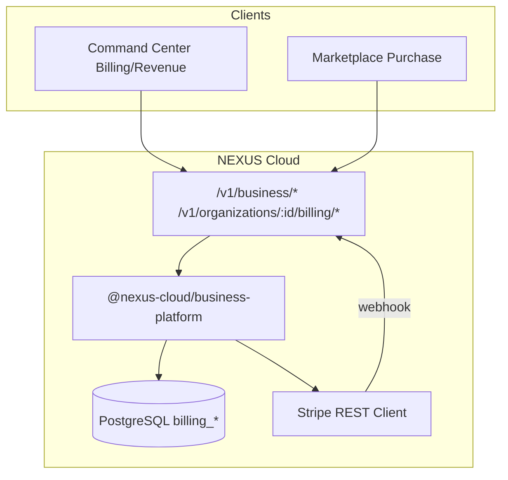
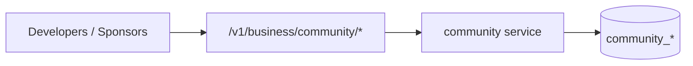
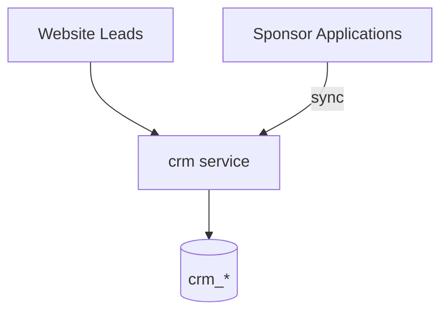
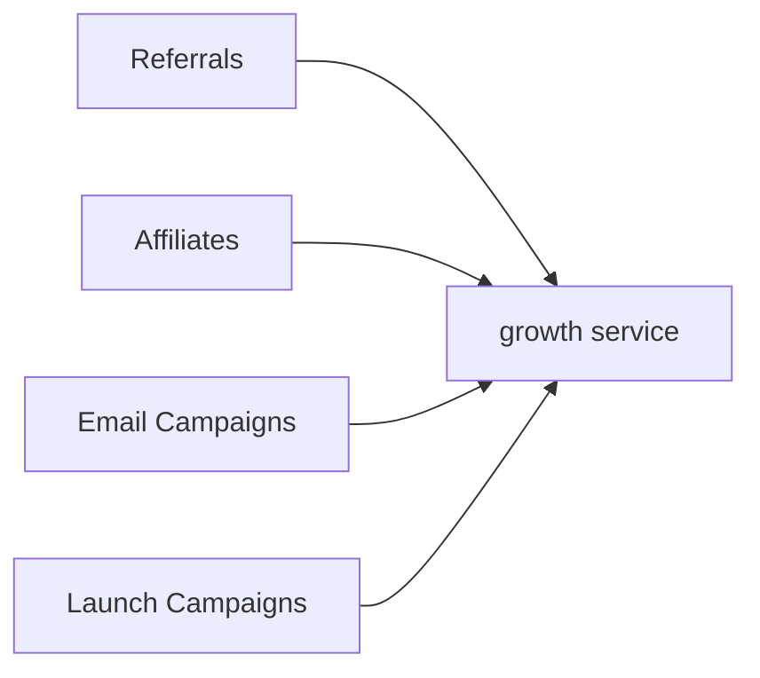

# EPIC 32 — NEXUS Business Platform STOP Report

## Quality Gate

| Check | Status |
|-------|--------|
| Billing operational | ✓ `@nexus-cloud/business-platform` billing + Stripe webhook |
| Marketplace payments operational | ✓ `billing_marketplace_transactions` + revenue split |
| Community operational | ✓ Forums, leaderboard, events, activity |
| CRM operational | ✓ Leads, deals, sponsor pipeline, investors |
| Growth systems operational | ✓ Referrals, affiliates, campaigns, newsletter |
| Build | ✓ `tsc --noEmit` |
| TypeScript | ✓ |
| Documentation | ✓ ADR-121 through ADR-124 |

Note: User-requested ADR numbers 117–120 conflict with EPIC 31 (AI Platform). Business platform ADRs use **121–124**.

## Folder Tree

```
nexus-cloud/
├── packages/business-platform/       # NEW
│   └── src/
│       ├── index.ts
│       ├── billing.ts
│       ├── stripe.ts
│       ├── community.ts
│       ├── crm.ts
│       └── growth.ts
├── packages/database/
│   ├── migrations/0020_business_platform.sql
│   └── src/schema/business.ts
├── apps/api/src/routes/business-platform.ts
nexus-studio/src/command-center/panels/
├── BillingPanel.tsx
├── CrmPanel.tsx
├── CommunityPanel.tsx
├── MarketingPanel.tsx
├── RevenuePanel.tsx
└── GrowthPanel.tsx
nexus-website/docs/adr/
├── ADR-121-business-platform.md
├── ADR-122-community-platform.md
├── ADR-123-crm.md
└── ADR-124-growth-platform.md
```

## Billing Architecture



**Capabilities:** subscriptions, licenses, invoices, payments, coupons, credits, usage meters, tax rates, marketplace transactions, developer payouts, financial dashboard.

## Community Architecture



**Capabilities:** profiles, forums, threads/posts, messaging, events, followers, achievements, reputation, leaderboard, activity feed.

## CRM Architecture



**Capabilities:** leads, contacts, deals, sponsor pipeline, investor records, CRM dashboard.

## Growth Platform



**Capabilities:** referral codes, affiliate enrollment, email campaigns, newsletter, launch/beta campaigns, growth dashboard.

## Files Created

- `packages/business-platform/**` (6 files)
- `packages/database/migrations/0020_business_platform.sql`
- `packages/database/src/schema/business.ts`
- `apps/api/src/routes/business-platform.ts`
- 6 Command Center panels
- ADR-121 through ADR-124

## Files Modified

- `apps/api/src/app.ts`, `context.ts`, `routes/index.ts`, `package.json`
- `packages/database/src/schema/index.ts`
- `nexus-studio/CommandCenterPanel.tsx`

## Future Work

- Stripe Connect onboarding for publisher payouts
- Automated usage billing from AI inference logs
- Real-time email delivery via Resend integration
- Full forum UI in website (not just Command Center)
- Affiliate commission settlement automation
- PDF invoice generation
- Multi-currency support

**STOP.**
