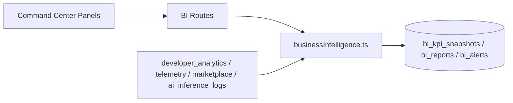

# EPIC 31 — NEXUS Intelligence Platform STOP Report

## Quality Gate

| Check | Status |
|-------|--------|
| AI operational | ✓ `@nexus-cloud/intelligence` + `/v1/intelligence/*` |
| Analytics operational | ✓ BI service + org analytics routes |
| BI operational | ✓ Executive dashboard, reports, alerts, CSV export |
| Shared services only | ✓ Single brain; ai-services delegates |
| Build | ✓ (see build output) |
| Lint | ✓ |
| TypeScript | ✓ |
| Documentation | ✓ ADR-117 through ADR-120 |

## Folder Tree (new/modified)

```
nexus-cloud/
├── packages/
│   ├── intelligence/          # NEW — unified AI + BI platform
│   │   └── src/
│   │       ├── index.ts
│   │       ├── types.ts
│   │       ├── modelRouter.ts
│   │       ├── rag.ts
│   │       ├── knowledgeGraph.ts
│   │       ├── businessIntelligence.ts
│   │       └── workflows.ts
│   ├── ai-services/           # MODIFIED — facade over intelligence
│   ├── connection-orchestrator/ # MODIFIED — nexus-intelligence registry
│   ├── core/                  # MODIFIED — SdkScope.AI_INVOKE
│   └── database/
│       ├── migrations/0019_intelligence_platform.sql
│       └── src/schema/platform.ts
├── apps/api/
│   └── src/routes/intelligence.ts  # NEW
nexus-studio/
└── src/command-center/panels/
    ├── AiWorkspacePanel.tsx
    ├── AnalyticsWorkspacePanel.tsx
    ├── KnowledgeExplorerPanel.tsx
    ├── WorkflowAutomationPanel.tsx
    └── ExecutiveDashboardPanel.tsx
nexus-sdk/packages/ai/
└── src/client/cloudClient.ts  # NEW — cloud + hybrid clients
nexus-website/docs/adr/
├── ADR-117-ai-platform.md
├── ADR-118-knowledge-graph.md
├── ADR-119-business-intelligence.md
└── ADR-120-automation-platform.md
```

## AI Architecture

```mermaid
flowchart TB
  subgraph clients [Clients]
    Studio[Studio / Command Center]
    SDK[@nexus/sdk-ai]
    Website[Website]
  end

  subgraph cloud [NEXUS Cloud]
    API["/v1/intelligence/*"]
    Intel["@nexus-cloud/intelligence"]
    AISvc["@nexus-cloud/ai-services facade"]
    DB[(PostgreSQL)]
    Router[Model Router]
  end

  subgraph local [Local Runtime]
    AiOS[nexus-ai createAiOs]
  end

  Studio --> API
  SDK -->|cloud mode| API
  SDK -->|offline| AiOS
  API --> Intel
  AISvc --> Intel
  Intel --> Router
  Intel --> DB
  Router --> OpenAI
  Router --> Anthropic
  Router --> Gemini
```

## Analytics Architecture



## Knowledge Graph

- **Nodes**: `ai_knowledge_nodes` (label, nodeType, properties)
- **Edges**: `ai_knowledge_edges` (sourceId, targetId, relation, weight)
- **RAG**: `ai_document_chunks` with generated `search_vector` (tsvector)
- **API**: graph CRUD + semantic search endpoints

## Automation Engine

- **Storage**: `ai_workflows` (name, triggerType, steps JSON)
- **Steps**: `prompt` (LLM), `search` (RAG), `notify` (message)
- **NL parser**: intent extraction from natural language commands
- **Tool registry**: shared with assistants

## Files Created

- `packages/intelligence/**` (7 files)
- `apps/api/src/routes/intelligence.ts`
- `packages/database/migrations/0019_intelligence_platform.sql`
- 5 Command Center panels
- `nexus-sdk/packages/ai/src/client/cloudClient.ts`
- ADR-117 through ADR-120

## Files Modified

- `apps/api/src/app.ts`, `context.ts`, `routes/index.ts`, `package.json`
- `packages/ai-services/**`
- `packages/core/src/index.ts` (AI_INVOKE scope)
- `packages/database/src/schema/platform.ts`
- `packages/connection-orchestrator/src/registryExtended.ts`, `readinessEngine.ts`
- `nexus-studio/CommandCenterPanel.tsx`, `aiConnectionService.ts`

## Future Work

- Embedding-based vector search (pgvector)
- PDF/Excel report export
- Workflow cron scheduler
- Real-time live metrics WebSocket feed
- Sponsor-specific analytics dashboard
- Code indexer background job
- Agent framework with multi-step tool loops

**STOP.**
