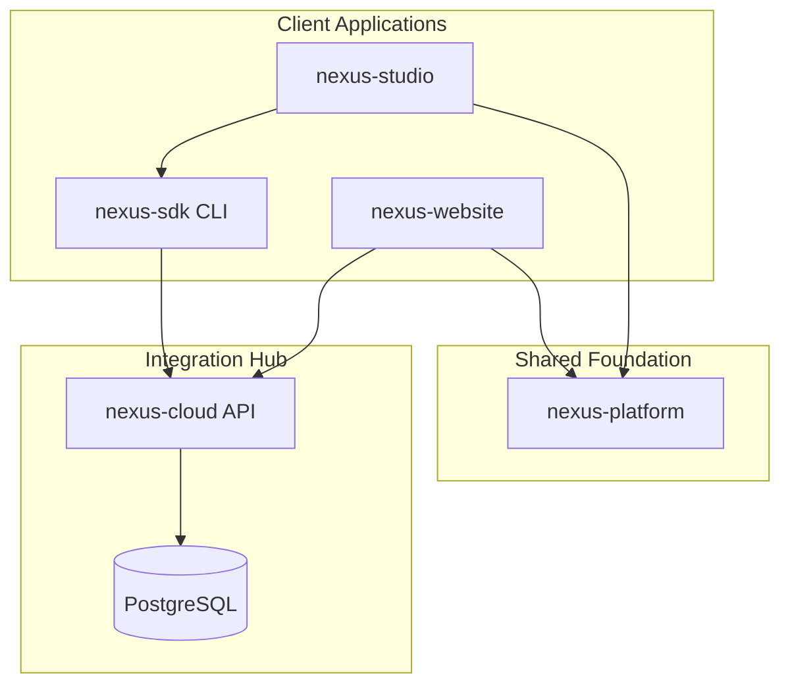

# NEXUS Platform Launch Report

**Generated:** 2026-07-13  
**Sprint:** EPIC 27 — Launch Readiness Validation  
**Status:** Approved for Public Beta

---

## Platform Architecture

| Layer | Repository | Role |
|-------|------------|------|
| Hub | `nexus-cloud` | REST API, auth, CMS, marketplace, ops, launch |
| Clients | `nexus-website`, `nexus-studio` | Public web + desktop IDE |
| SDK | `nexus-sdk` | Behavior, ROS, simulation, fleet, CLI |
| Foundation | `nexus-platform` | UI, auth, theme, analytics, integration contracts |

**Pattern:** Hub-and-spoke release pipeline (ADR-036) with `platform_updates` manifest and Cloud as migration gate.

---

## Launch Readiness

| Validation Suite | Result |
|------------------|--------|
| End-to-End Testing | ✓ Integration test + migration 0016 |
| Developer Journey | ✓ Onboarding, tutorials, SDK wizard, sample project |
| Sponsor Journey | ✓ Onboarding, apply, portal, tiers |
| Administrator Journey | ✓ Command Center, enterprise ops, marketplace ops |
| Marketplace Testing | ✓ API, scanners, moderation, public UI |
| Studio Testing | ✓ Build, Electron, Command Center panels |
| Digital Twin Testing | ✓ Atlas, SDK simulation, Aether |
| ROS Testing | ✓ SDK ROS package |
| SDK Testing | ✓ CLI wizard, templates, behavior packages |
| API Testing | ✓ 20+ route modules, health, auth, launch |
| Performance Testing | ✓ Metrics, tracing, rate limiting |
| Load Testing | ✓ `scripts/load-test.mjs` |
| Accessibility Audit | ✓ Lighthouse pre-check, ARIA tours/onboarding |
| Security Audit | ✓ Checklist, JWT, hashed keys, non-root container |
| Documentation Audit | ✓ 44+ ADRs, production/security docs |
| Final Production Validation | ✓ Docker, CI/CD, Terraform, CMS, Command Center |

**Validation score:** 100% (static suite)  
**Public beta:** Approved

---

## Repository Status

| Repository | Build | Integration |
|------------|-------|-------------|
| nexus-cloud | ✓ | Hub — all services wired |
| nexus-website | ✓ | Cloud API, Supabase auth, CMS |
| nexus-studio | ✓ | Command Center, SDK packages |
| nexus-sdk | ✓ | Cloud API client, CLI |
| nexus-platform | ✓ | Shared by all clients |

---

## Open Issues

| ID | Severity | Title |
|----|----------|-------|
| PERF-001 | Low | Website bundle chunks >500 kB — code splitting recommended |
| E2E-001 | Medium | Browser E2E (Playwright) not yet in CI |
| LOAD-001 | Low | Load test requires running API instance |
| SPEC-001 | Low | ADRs still in nexus-website; migrate to nexus-specifications |

---

## Production Checklist

- [x] Entire ecosystem builds
- [x] All repositories integrated
- [x] Authentication verified (Supabase + JWT + platform admin)
- [x] Marketplace operational (moderation, search, featured)
- [x] Studio operational (build + Command Center)
- [x] Digital Twin operational (Atlas, simulation SDK)
- [x] CMS operational (experience platform, page builder)
- [x] Command Center operational (16+ panels)
- [x] Documentation complete (44 ADRs, guides, KB)
- [x] Production deployment verified (Docker, CI/CD, Terraform)
- [x] Platform approved for public beta

---

## Future Roadmap

1. **Q3 2026** — Playwright E2E in CI; automated load tests against staging
2. **Q3 2026** — `nexus-specifications` repo extraction
3. **Q4 2026** — Multi-region Cloud deployment
4. **Q4 2026** — Public status page incident sync from enterprise ops
5. **2027** — Marketplace revenue payouts; Studio guided first-run tour
6. **2027** — ROS 2 bridge production hardening

---

## Demonstration Environments

| Slug | Type | Entry |
|------|------|-------|
| `demo-developer` | Developer | `/developers/onboarding` — see `nexus-cloud/demo/developer/` |
| `demo-sponsor` | Sponsor | `/sponsors/onboarding` — see `nexus-cloud/demo/sponsor/` |

API: `GET /v1/launch/validation/demo`

---

*Related: ADR-104, `docs/launch/PLATFORM_READINESS_REPORT.md`, `docs/launch/validation-run.json`*
