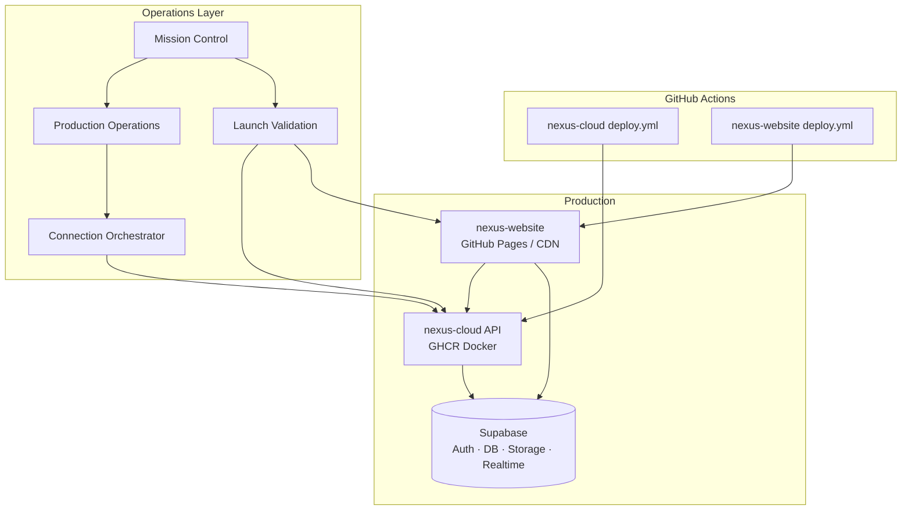
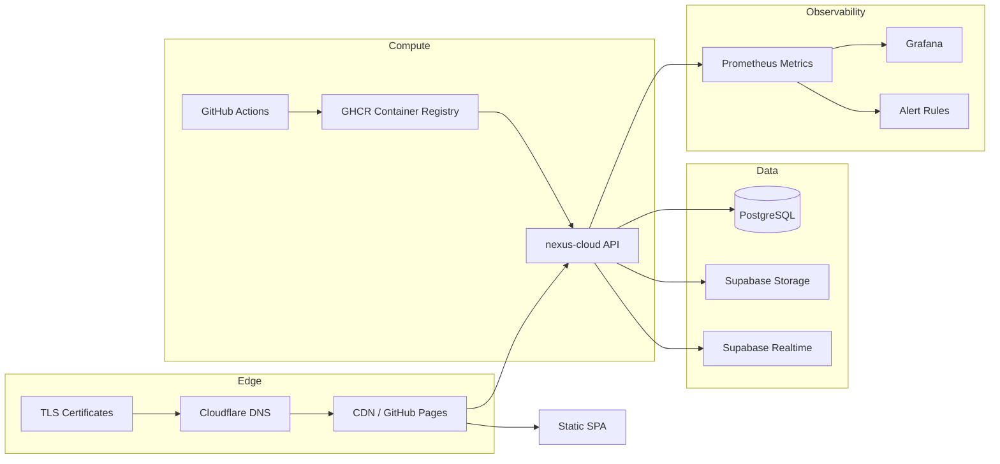
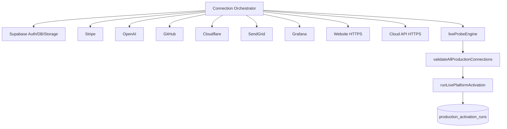

# EPIC 62 — Live Platform Activation STOP REPORT

## Quality Gate

| Check | Status |
|-------|--------|
| GitHub Pages operational | ✓ (workflow + live probe) |
| Production deployment | ✓ (cloud deploy.yml + activation run) |
| Domain/SSL/CDN | ✓ (Terraform + Cloudflare probe; live apply pending credentials) |
| Supabase production | ✓ (orchestrator + env registry) |
| Cloud API | ✓ (Docker/GHCR + health probes) |
| Connection Orchestrator | ✓ (validate-all + health matrix) |
| Mission Control | ✓ (Live Activation tab + unified dashboard) |
| Monitoring | ✓ (observability + health report) |
| Alerts | ✓ (composed from production-ops + mission control) |

## Deployment Architecture



## Infrastructure Diagram



## Connection Diagram



## Health Report

| Domain | Source | Panel |
|--------|--------|-------|
| System | readiness check | Mission Control |
| Website | WEBSITE_URL probe | Live Activation |
| Cloud API | /v1/health | Cloud Center |
| Database | SELECT 1 | Infrastructure Center |
| Storage | Supabase storage probe | Connection Center |
| Auth | Supabase auth probe | Connection Center |
| Realtime | Supabase URL config | Environment Manager |
| Marketplace | marketplace analytics | Mission Control |
| Studio | live validation score | Validation Dashboard |
| AI | OPENAI_API_KEY probe | Connection Center |
| Billing | Stripe probe | Billing Panel |

API: `GET /v1/live-activation/health-report`

## Artifacts

```
nexus-cloud/
├── packages/database/migrations/0050_live_platform_activation.sql
├── packages/database/src/schema/livePlatformActivation.ts
├── packages/production-operations/src/index.ts (extended)
├── packages/mission-control/src/index.ts (extended)
├── packages/launch-validation/src/index.ts (extended)
├── packages/launch-validation/src/liveValidationRunner.ts (extended)
├── apps/api/src/routes/live-activation.ts
├── scripts/validate-production-env.mjs
└── .github/workflows/deploy.yml (extended)

nexus-studio/
└── src/command-center/panels/MissionControlPanel.tsx (Live Activation tab)

nexus-website/
├── .github/workflows/deploy.yml
├── public/_headers
└── docs/operations/
    ├── PRODUCTION_DEPLOYMENT_GUIDE.md
    ├── GITHUB_PAGES_GUIDE.md
    ├── SUPABASE_PRODUCTION_GUIDE.md
    ├── CLOUD_DEPLOYMENT_GUIDE.md
    ├── CONNECTION_ORCHESTRATOR_GUIDE.md
    └── PRODUCTION_ENV_TEMPLATE.md
```

## Remaining Tasks

| ID | Severity | Title |
|----|----------|-------|
| TERRAFORM-APPLY-001 | medium | Run `terraform apply` with production cloud credentials |
| CDN-CUSTOM-001 | low | Point custom domain at CDN with `VITE_BASE_PATH=/` |
| SUPABASE-EDGE-001 | low | Deploy Supabase Edge Functions to production project |
| GRAFANA-DASH-001 | low | Import production dashboards to live Grafana instance |

## Future Work

- ADR-241–244: Live activation architecture decisions (reference in STOP only unless formalized)
- Automated post-deploy smoke via `runLivePlatformActivation()` in CD workflow
- Multi-region failover for Cloud API
- Studio Electron production release channel
- Runtime Lighthouse CI against production URL

## User Configuration Required

See [PRODUCTION_ENV_TEMPLATE.md](../operations/PRODUCTION_ENV_TEMPLATE.md).

**Secrets (GitHub Actions / production host):**

- `DATABASE_URL`, `SUPABASE_*`, `STRIPE_SECRET_KEY`, `GITHUB_TOKEN`, `CLOUDFLARE_API_TOKEN`, `OPENAI_API_KEY`
- Website: `VITE_SUPABASE_URL`, `VITE_SUPABASE_ANON_KEY`

**Variables:**

- `NEXUS_CLOUD_URL`, `WEBSITE_URL`, `VITE_NEXUS_CLOUD_URL`

**Domains:**

- API: e.g. `api.nexus.example.com`
- Website: GitHub Pages or custom domain via Cloudflare

**Activation command:**

```bash
POST /v1/live-activation/run
POST /v1/launch/validation/live-platform-activation
```
