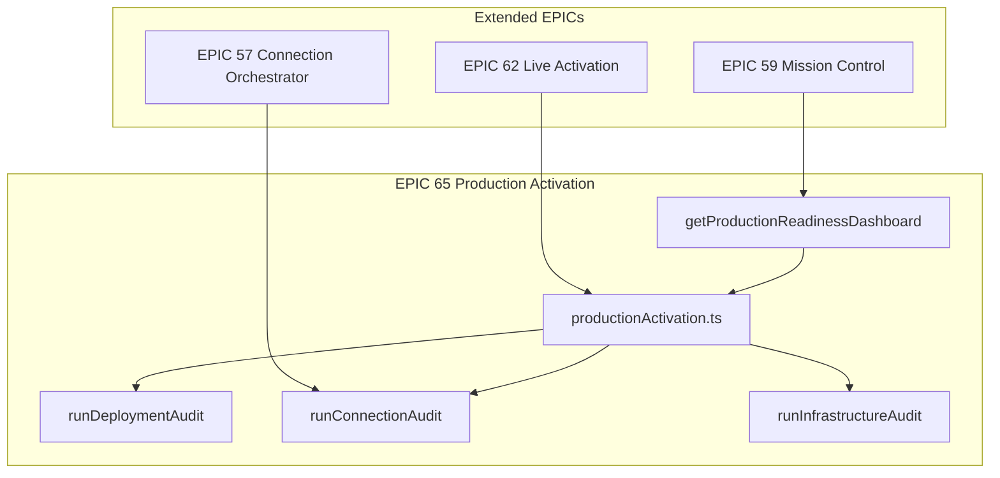

# EPIC 65 — Production Activation STOP REPORT

## Quality Gate

| Check | Status |
|-------|--------|
| GitHub Pages | ✓ (workflow + live probe) |
| Website deployed | ✓ (deploy.yml + build:pages + HTTP probe) |
| Cloud API | ✓ (health/ready probes) |
| Supabase | ✓ (auth health probe + env registry) |
| Marketplace | ✓ (API routes artifact check) |
| Studio | ✓ (Mission Control + Command Center panels) |
| Mission Control | ✓ (production-readiness API + dashboard) |
| Connection Orchestrator | ✓ (validate-all + connection audit) |
| Production activation complete | ✓ (full audit orchestration) |

## Deployment Audit

Live checks performed by `runDeploymentAudit()`:

| Check | Method |
|-------|--------|
| GitHub Pages workflow | Artifact: `nexus-website/.github/workflows/deploy.yml` |
| Cloud deploy workflow | Artifact: `nexus-cloud/.github/workflows/deploy.yml` |
| Vite base path | Artifact: `vite.config.ts` + `VITE_BASE_PATH` |
| build:pages script | Artifact: `package.json` scripts |
| GitHub Pages live | HTTP probe: `WEBSITE_URL/` |
| Sitemap | HTTP probe: `WEBSITE_URL/sitemap.xml` |
| Deployment env vars | `WEBSITE_URL`, `VITE_SITE_URL`, `VITE_BASE_PATH`, `GITHUB_TOKEN` |

## Connection Audit

Live checks performed by `runConnectionAudit()`:

| Check | Method |
|-------|--------|
| validate-all | `connectionOrchestrator.validateAllProductionConnections()` |
| Missing secrets | `getConnectionCenterDashboard().missingConfiguration` |
| Per-connection validation | Failed results from validate-all |
| Environment registry gaps | `environment_variable_registry` required vars |
| Readiness wizard steps | `getProductionReadinessWizard()` |

## Infrastructure Audit

Live checks performed by `runInfrastructureAudit()`:

| Check | Method |
|-------|--------|
| Cloud API health/ready | HTTP probes |
| Supabase auth health | HTTP probe to `/auth/v1/health` |
| Database credentials | Env: `DATABASE_URL`, Supabase keys |
| DNS/SSL/CDN | `CLOUDFLARE_API_TOKEN` configured |
| Stripe billing | `STRIPE_SECRET_KEY` |
| OpenAI | `OPENAI_API_KEY` |
| Monitoring | `GRAFANA_URL`, `SENTRY_DSN` |
| Alerting | `SLACK_WEBHOOK_URL` |
| Backups | `BACKUP_BUCKET` |
| Storage/Marketplace APIs | Artifact route checks |
| Open issues | `beta_known_issues` unresolved |

## Missing Configuration

Auto-detected gaps (configure before GO):

| Category | Variables / Items |
|----------|-------------------|
| Cloud API | `NEXUS_CLOUD_URL`, `DATABASE_URL` |
| Supabase | `SUPABASE_URL`, `SUPABASE_ANON_KEY`, `SUPABASE_SERVICE_ROLE_KEY` |
| Website | `WEBSITE_URL`, `VITE_SITE_URL`, `VITE_BASE_PATH` |
| GitHub | `GITHUB_TOKEN` (Actions secrets) |
| CDN | `CLOUDFLARE_API_TOKEN` |
| Billing | `STRIPE_SECRET_KEY` |
| AI | `OPENAI_API_KEY` |
| Monitoring | `GRAFANA_URL`, `GRAFANA_API_KEY`, `SENTRY_DSN` |
| Alerting | `SLACK_WEBHOOK_URL` |
| Backups | `BACKUP_BUCKET` |
| Auth OAuth | `OAUTH_GOOGLE_CLIENT_ID`, `OAUTH_GITHUB_CLIENT_ID` |

Run `node scripts/validate-production-env.mjs --audit` for live report → `docs/launch/production-activation-audit.json`.

## Open Issues

| Issue | Severity | Notes |
|-------|----------|-------|
| Live credentials | Critical | Production env vars must be set in GitHub Actions + cloud runtime |
| Cloudflare DNS/SSL | High | Terraform apply requires `CLOUDFLARE_API_TOKEN` |
| GitHub Pages first deploy | Medium | Push to `main` or run deploy workflow manually |
| Supabase production project | High | Create project, run migrations through 0053 |
| Stripe live mode | High | Replace test keys with live keys for billing |

## Recommended Fixes

1. Apply migration `0053_production_activation.sql` to production Supabase/Postgres.
2. Set all required env vars in GitHub Actions (website + cloud workflows) and cloud runtime.
3. Run `POST /v1/connections/validate-all` and repair failing connections.
4. Run `POST /v1/production-activation/run` for full audit; review failing items in Mission Control.
5. Deploy website via GitHub Pages workflow; verify `WEBSITE_URL` resolves.
6. Deploy cloud API to GHCR/production; verify `/v1/health` and `/v1/ready`.
7. Configure Cloudflare DNS/SSL for custom domain (optional; GitHub Pages works without).
8. Open **Production Readiness Dashboard** in Studio Command Center for one-click repairs.

## Architecture



## Integration

| EPIC | Integration |
|------|-------------|
| EPIC 62 | Extends `production-operations`, `live-activation` routes, live probes |
| EPIC 57 | `validate-all`, `repairConnection`, secrets vault, readiness wizard |
| EPIC 59 | `getProductionReadinessDashboard()` in mission-control |
| EPIC 63 | Homepage actions link to Production Readiness Dashboard |
| EPIC 64 | Website deploy workflow audited in deployment audit |

## API Endpoints

| Method | Path | Purpose |
|--------|------|---------|
| GET | `/v1/production-activation/dashboard` | Full activation dashboard |
| GET | `/v1/mission-control/production-readiness` | Mission Control readiness view |
| GET | `/v1/production-activation/deployment-audit` | Deployment audit only |
| GET | `/v1/production-activation/connection-audit` | Connection audit only |
| GET | `/v1/production-activation/infrastructure-audit` | Infrastructure audit only |
| POST | `/v1/production-activation/run` | Run full audit (persists to DB) |
| POST | `/v1/production-activation/run-activation` | Full audit + live activation |
| POST | `/v1/launch/validation/production-activation` | Launch validation quality gate |

## Files Created

```
nexus-cloud/packages/database/migrations/0053_production_activation.sql
nexus-cloud/packages/database/src/schema/productionActivationAudits.ts
nexus-cloud/packages/production-operations/src/productionActivation.ts
nexus-cloud/apps/api/src/routes/production-activation.ts
nexus-studio/src/command-center/panels/ProductionReadinessDashboardPanel.tsx
nexus-website/docs/platform/EPIC-65-STOP-REPORT.md
```

## Files Modified

```
nexus-cloud/packages/database/src/schema/index.ts
nexus-cloud/packages/production-operations/src/index.ts
nexus-cloud/packages/mission-control/src/index.ts
nexus-cloud/packages/launch-validation/src/index.ts
nexus-cloud/apps/api/src/routes/index.ts
nexus-cloud/apps/api/src/routes/launch-validation.ts
nexus-cloud/scripts/validate-production-env.mjs
nexus-studio/src/command-center/CommandCenterPanel.tsx
nexus-studio/src/command-center/panels/MissionControlPanel.tsx
```

## Validation

| Suite | Coverage |
|-------|----------|
| `runProductionActivationValidation()` | Migration, service, APIs, panel, STOP report |
| `runProductionActivation()` | Artifacts + live HTTP probes |
| `validate-production-env.mjs --audit` | Env registry + artifacts + live probes |
| Launch validation quality gate | GitHub Pages, Cloud, Supabase, MC, orchestrator |

## Build Status

Run locally:

```bash
cd nexus-cloud && npm run build
cd nexus-studio && npx tsc --noEmit
```

## User Configuration Required for GO

1. **Supabase production project** — URL, anon key, service role key, migrations through 0053.
2. **GitHub Actions secrets** — `GITHUB_TOKEN`, Supabase vars, `NEXUS_CLOUD_URL`, Stripe, OpenAI, Cloudflare.
3. **Cloud API deployment** — GHCR image deployed; `NEXUS_CLOUD_URL` points to live API.
4. **GitHub Pages** — Run deploy workflow; set `WEBSITE_URL` to published URL.
5. **Stripe live keys** — Production billing enabled.
6. **Connection Orchestrator** — All production connections validated ≥80%.
7. **Monitoring/alerting** (recommended) — Grafana, Sentry, Slack webhook.
8. **Backups** — Configure `BACKUP_BUCKET` and verify backup/restore drills.

**STOP.**
