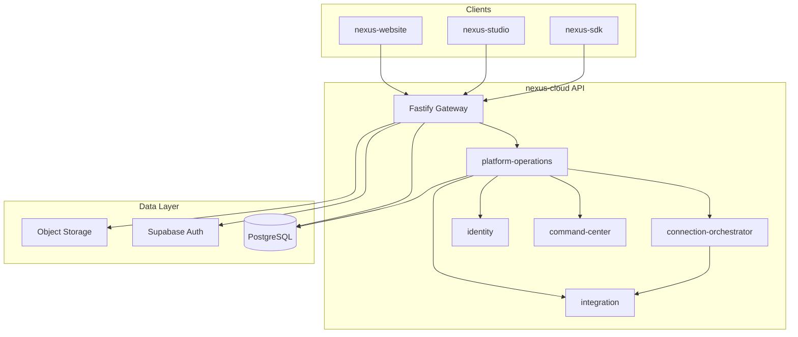

# PROGRAM ALPHA Phase 1 — STOP Report

**Generated:** 2026-07-14  
**Program:** Live Infrastructure & Ecosystem Integration

---

## Folder Tree (New & Key Paths)

```
nexus-cloud/
├── packages/platform-operations/
│   ├── package.json
│   └── src/
│       ├── index.ts
│       ├── moduleRegistry.ts      # 17 ecosystem modules + 10 wizard steps
│       ├── setupWizard.ts         # First-run wizard service
│       └── startupValidation.ts   # Unified validation + module sync
├── packages/database/
│   ├── migrations/0022_platform_operations.sql
│   └── src/schema/platformOps.ts
├── apps/api/src/
│   ├── routes/platform-operations.ts
│   ├── app.ts                     # Wired platformOperations service
│   └── index.ts                   # Startup validation on boot
└── scripts/bootstrap-phase1.mjs

nexus-studio/src/command-center/
├── CommandCenterPanel.tsx         # SetupWizard + Platform Ops + Admin panels
└── panels/
    ├── SetupWizardPanel.tsx
    ├── PlatformOperationsPanel.tsx
    └── AdminFirstLoginPanel.tsx

nexus-website/
├── src/pages/Admin/AdminSetup.tsx
├── src/services/platform/platformOpsService.ts
├── src/pages/Auth/Login.tsx       # Redirect to /admin/setup when uninitialized
└── docs/adr/
    ├── ADR-129-platform-operations.md
    ├── ADR-130-live-infrastructure.md
    ├── ADR-131-setup-wizard.md
    └── ADR-132-administrator-experience.md
```

---

## Infrastructure Architecture



---

## Startup Sequence

1. `loadConfig()` → create database pool
2. Instantiate services (auth, CMS, marketplace, connection orchestrator, command center, **platform-operations**)
3. Register routes including `/v1/platform-ops/*`
4. Listen on configured host/port
5. **`runStartupValidation()`** — sync modules, run category checks, persist `platform_startup_reports`
6. Log overall status, score, duration

---

## Setup Wizard Flow

| Step | ID | Action |
|------|-----|--------|
| 1 | platform_info | Company, platform name, environment, timezone |
| 2 | administrator | Admin credentials / MFA |
| 3 | supabase | Validate Supabase connection |
| 4 | postgresql | Validate DB + migrations |
| 5 | storage | Validate object storage |
| 6 | github | GitHub Actions / deployments |
| 7 | ai_providers | OpenAI, Anthropic, Gemini |
| 8 | email | Resend / SMTP |
| 9 | marketplace | Stripe billing |
| 10 | review | Full validation + complete |

**On complete:** default orgs, platform-admin membership, feature flags enabled, `platform_initialized = true`.

**Auto-launch:** Studio `SetupWizardPanel` when `!initialized`; Website login redirects to `/admin/setup`.

---

## Connection Architecture

- **ECOSYSTEM_MODULES** (17) map to Connection Orchestrator service IDs where applicable
- `syncModuleRegistry()` upserts `platform_module_registrations` from orchestrator dashboard
- Each module: env vars, dependencies, capabilities, recovery steps, health status, latency, diagnostics
- Reuses existing `/v1/connections/*` — no duplicate orchestrator

---

## Authentication Flow

1. Single Supabase JWT across Website, Studio, Command Center, portals
2. Cloud API verifies bearer → org membership → platform role
3. Setup routes: **public when uninitialized**; platform admin required after init
4. Admin dashboard: `requirePlatformAdmin` + live DB metrics

---

## Files Created

| Path | Purpose |
|------|---------|
| `nexus-cloud/packages/platform-operations/**` | Platform ops package |
| `nexus-cloud/packages/database/migrations/0022_platform_operations.sql` | Schema |
| `nexus-cloud/packages/database/src/schema/platformOps.ts` | Drizzle schema |
| `nexus-cloud/apps/api/src/routes/platform-operations.ts` | REST API |
| `nexus-cloud/scripts/bootstrap-phase1.mjs` | Bootstrap script |
| `nexus-studio/.../SetupWizardPanel.tsx` | Studio wizard |
| `nexus-studio/.../PlatformOperationsPanel.tsx` | Ops workspace |
| `nexus-studio/.../AdminFirstLoginPanel.tsx` | Admin dashboard |
| `nexus-website/src/pages/Admin/AdminSetup.tsx` | Website wizard |
| `nexus-website/src/services/platform/platformOpsService.ts` | Website client |
| `nexus-website/docs/adr/ADR-129..132` | ADRs |

---

## Files Modified

| Path | Change |
|------|--------|
| `nexus-cloud/apps/api/src/app.ts` | Wire platformOperations |
| `nexus-cloud/apps/api/src/index.ts` | Boot validation |
| `nexus-cloud/apps/api/src/routes/index.ts` | Register routes |
| `nexus-cloud/apps/api/src/routes/context.ts` | AppContext type |
| `nexus-cloud/apps/api/package.json` | Dependency |
| `nexus-cloud/packages/database/src/schema/index.ts` | Export platformOps |
| `nexus-studio/.../CommandCenterPanel.tsx` | Mount panels |
| `nexus-website/src/router/AppRouter.tsx` | `/admin/setup` |
| `nexus-website/src/config/websiteRoutes.ts` | Route config |
| `nexus-website/src/pages/Auth/Login.tsx` | Setup redirect |

---

## Quality Gate

| Check | Status |
|-------|--------|
| Platform operations package | ✓ |
| Migration 0022 | ✓ (schema defined) |
| API routes `/v1/platform-ops/*` | ✓ |
| Connection Orchestrator integration | ✓ |
| Setup Wizard (10 steps) | ✓ |
| Command Center panels | ✓ |
| Website admin setup + login redirect | ✓ |
| Startup validation on boot | ✓ |
| nexus-cloud build | ✓ |
| nexus-cloud lint | ✓ |
| nexus-website build | ✓ |
| nexus-studio build | ⚠ Pre-existing TS errors (ThemeManagerPanel, ThreatMonitorPanel, SDK) |
| ADR-129–132 | ✓ |

---

## Open Items

1. Run `npm run db:migrate` against production PostgreSQL to apply 0022
2. Run `node scripts/bootstrap-phase1.mjs` after DB is live
3. Wire admin user creation in setup step 2 to Supabase Admin API (currently validates JWT config)
4. nexus-studio pre-existing TypeScript errors unrelated to Phase 1

---

## Future Work

- Per-module WebSocket health streaming to Command Center
- Setup wizard env-var persistence to secrets vault (orchestrator)
- Website admin first-login dashboard page (currently Studio + API)
- Extend launch-validation script with platform-ops checklist assertions
- SDK / Studio connection registration callbacks on client boot

---

**STOP.**
