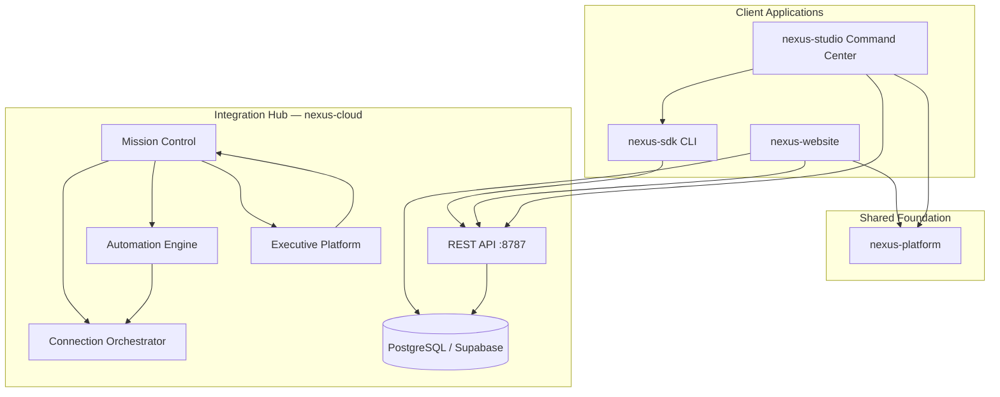

# NEXUS Platform — Next Phase Handoff

**Generated:** 2026-07-20  
**Scope:** Post EPIC 55–68 (Phase 9–10 complete; production certification ready)  
**Audience:** Platform engineering, operations, and leadership preparing the next development phase

This document summarizes the current NEXUS platform architecture, completed epic work, repository and database state, production configuration requirements, known blockers, and recommended next steps. All facts below were verified against the codebase (`nexus-cloud`, `nexus-website`, `nexus-studio`, `nexus-sdk`, `nexus-platform`, `nexus-specifications`) and EPIC STOP reports in `docs/platform/`.

---

## Current Architecture

NEXUS follows a **hub-and-spoke** pattern: `nexus-cloud` is the integration hub (REST API, auth, CMS, marketplace, operations, launch validation); client applications connect through shared foundation packages in `nexus-platform` and the SDK in `nexus-sdk`.

| Layer | Repository | Role |
|-------|------------|------|
| Hub | `nexus-cloud` | REST API, PostgreSQL/Supabase, connection orchestrator, mission control, automation, executive platform |
| Public web | `nexus-website` | Marketing site, developer/sponsor portals, website admin (`/admin`) |
| Desktop IDE | `nexus-studio` | Electron app with **Studio Command Center** (primary ops UI for administrators) |
| SDK | `nexus-sdk` | Behavior, simulation, ROS, fleet, CLI, and integration packages |
| Foundation | `nexus-platform` | UI, auth, theme, analytics, integration contracts shared by clients |
| Specifications | `nexus-specifications` | Architecture Decision Records (ADRs 036–240+) |

### Operations layers (EPICs 57–61)

| Component | Epic | Purpose |
|-----------|------|---------|
| **Connection Orchestrator** | 57, 62 | 41+ registered services; credential store, live probes, dependency graph, setup wizards |
| **Mission Control** | 59, 63 | Primary administrator landing — KPI tiles, health scoring, action center, homepage feeds |
| **Automation Engine** | 60 | Scheduled validation, self-healing, maintenance windows, 15 default automation jobs |
| **Executive Platform** | 61 | KPI engine, AI reporting, strategic planning, Mission Control Executive View tab |



**Administrator entry points:**

- **Studio Command Center** — `MissionControlPanel` is the first panel after Setup Wizard and Admin Wizard Hub; connects via `VITE_NEXUS_CLOUD_URL` (default dev: `http://localhost:8787`).
- **Website admin** — `/admin` (protected, `platformAdminRoles`) renders `AdminDashboard`, which loads Mission Control homepage data from `/v1/mission-control/homepage`.

---

## Completed Epics

### EPICs 55–68 (STOP reports present)

| Epic | Title | One-line summary |
|------|-------|------------------|
| **55** | Final Release | Production CI/CD, Docker, backup/restore, final release validation gate, operations docs (ADR-213–216); migrations through 0043 |
| **56** | Live Infrastructure & Platform Provisioning | Terraform foundation, live probes, `environment_variable_registry`, infrastructure/cloud/environment/backup panels (ADR-217–220); migration 0044 |
| **57** | Connection Orchestrator & Admin Experience | Zero-manual-config setup wizard, credential store, dependency graph, Connection Center (ADR-221–224); migration 0045 |
| **58** | Live Platform Validation & Private Beta | Developer/sponsor/admin cohort validation, beta dashboards, launch certification (ADR-225–228); migration 0046; seeds `beta_known_issues` |
| **59** | NEXUS Mission Control | Unified health/operations/action aggregation; website `/admin` and Studio default admin landing (ADR-229–232); migration 0047 |
| **60** | NEXUS Automation Engine | 60s scheduler tick, 15 default jobs, repair/maintenance panels (ADR-233–236); migration 0048 |
| **61** | NEXUS Executive Platform | KPI domains, executive reports, Mission Control Executive View, weekly/monthly automation jobs (ADR-237–240); migration 0049 |
| **62** | Live Platform Activation | GitHub Pages deploy workflow, live activation tab, env validation script, production operations guides; migration 0050 |
| **63** | NEXUS Admin Experience | 11 administrator wizards, Mission Control homepage KPI/feeds/actions, wizard progress in DB; migration 0051 |
| **64** | Website Completion | All public marketing pages, CMS seeds, SEO/sitemap, Playwright `website-completion.spec.ts`; CMS migration **0052** |

### EPIC 65 — Production Activation ✓

Live deployment/connection/infrastructure audits, Production Readiness Dashboard, `POST /v1/production-activation/run`. STOP: `EPIC-65-STOP-REPORT.md`. Migration: `0053`.

| Item | Status |
|------|--------|
| STOP report | **Present** — `docs/platform/EPIC-65-STOP-REPORT.md` |
| Migration | **0053** — `production_activation_audits`, feature flag `productionActivationEnabled`, registry extensions |
| Service code | `packages/production-operations/src/productionActivation.ts` — deployment/connection/infrastructure audits, readiness dashboard |
| API routes | **Complete** — `apps/api/src/routes/production-activation.ts` |
| TypeScript build | **Pass** — `npx tsc --noEmit` |

### EPIC 66 — Installation Manager & Connection Orchestrator 2.0 ✓

Zero-manual-config installation center, connection registry v2, setup wizards, first-run `/admin/installation` routing. STOP: `EPIC-66-STOP-REPORT.md`. Migration: `0054`. ADRs: **245–246**.

| Item | Status |
|------|--------|
| STOP report | **Present** — `docs/platform/EPIC-66-STOP-REPORT.md` |
| Migration | **0054** — `0054_installation_manager.sql` — `installation_progress`, `connection_service_registry` |
| Service code | `packages/platform-operations/src/installationManager.ts`, `packages/connection-orchestrator/src/connectionRegistryV2.ts` |
| API routes | `/v1/installation/*`, `/v1/connections/registry/v2`, `/v1/mission-control/installation-center` |
| Studio panels | `InstallationCenterPanel`, `SetupCenterPanel` |
| Website | `/admin/installation` first-run routing via `AdminInstallation.tsx` |

### EPIC 67 — Live Service Activation ✓

Repository-wide service inventory audit, live probe extensions (Stripe Connect, Supabase Realtime, PostHog, Sentry), Live Services Dashboard. STOP: `EPIC-67-STOP-REPORT.md`. Migration: `0055`. ADRs: **249–252**.

| Item | Status |
|------|--------|
| STOP report | **Present** — `docs/platform/EPIC-67-STOP-REPORT.md` |
| Migration | **0055** — `0055_live_services.sql` — `liveServicesEnabled`, service activation tables |
| Service code | `packages/live-services/src/` — `serviceInventory.ts`, `liveServicesEngine.ts` |
| API routes | `/v1/live-services/dashboard`, `/v1/live-services/validate`, `/v1/mission-control/live-services` |
| Studio panel | `LiveServicesDashboardPanel` |
| Backlog doc | `docs/platform/SERVICE_ACTIVATION_BACKLOG.md` |

### EPIC 68 — Production Certification ✓

Ecosystem certification (19 components), E2E journey validation (21 suites), composite GO/NO-GO scoring, production certification persistence. STOP: `EPIC-68-STOP-REPORT.md`. Migration: `0056`. ADRs: **253–256**.

| Item | Status |
|------|--------|
| STOP report | **Present** — `docs/platform/EPIC-68-STOP-REPORT.md` |
| Migration | **0056** — `0056_production_certification.sql` — `production_certification_runs`, `productionCertificationEnabled` |
| Service code | `packages/launch-validation/src/productionCertification.ts` — `runEcosystemCertificationValidation`, `runEndToEndCertification`, `getProductionCertificationReport` |
| API routes | `/v1/launch/validation/certification/production*`, `/v1/mission-control/production-certification` |
| Studio panel | `ProductionCertificationDashboardPanel` |
| Master docs | `MASTER_PLATFORM_CERTIFICATION.md`, `MASTER_CONNECTION_INVENTORY.md`, `MASTER_DEPLOYMENT_GUIDE.md`, `MASTER_ADMIN_GUIDE.md`, `MASTER_OPERATOR_GUIDE.md`, `MASTER_RECOVERY_GUIDE.md` |

### EPIC 69 — GitHub Pages Deployment ✓

GitHub Pages deployment status engine, Connect GitHub wizard, Mission Control deployment card. STOP: prior EPIC 70 repo report references EPIC 69 integration.

| Item | Status |
|------|--------|
| Service code | `packages/deployment/src/githubPagesDeployment.ts` |
| API routes | `/v1/mission-control/github-deployment`, `/v1/mission-control/github-connect-wizard` |
| Studio panel | `GitHubDeploymentStatusPanel` |
| Website service | `fetchGitHubDeploymentStatus()` |

### EPIC 70 — Repository Initialization & CI Build Stabilization ✓ (local)

Ecosystem repository audit, CI lint/build stabilization, Mission Control CI Health widget. STOP: `EPIC-70-CI-STOP-REPORT.md`, `EPIC-70-STOP-REPORT.md`.

| Item | Status |
|------|--------|
| Local lint/build | **Pass** — `npm run lint`, `npm run build`, `tsc --noEmit` |
| Remote CI/Pages | **Blocked** — empty GitHub repo; invalid `gh` auth |
| Service code | `packages/deployment/src/repositoryAudit.ts`, `ciBuildHealth.ts` |
| API routes | `/v1/mission-control/repository-infrastructure`, `/v1/mission-control/ci-health` |
| Homepage feed | `overviews.ciHealth`, `overviews.repositoryInfrastructure` |
| Studio panel | `CiBuildHealthPanel` |
| Website admin | `AdminCiHealthWidget` on `/admin` |
| Docs | `CI_BUILD_REPORT.md`, `LINT_FIX_REPORT.md`, `DEPLOYMENT_FIX_REPORT.md` |

### Earlier epics referenced in STOP reports

| Epic | Title | One-line summary |
|------|-------|------------------|
| **53** | Complete Ecosystem Integration | Cross-repo integration dashboard, ecosystem validation, website/studio/SDK/OS cloud sync (ADR-205–208) |
| **54** | UX Polish & Website Experience | MarketingPage layout, command palette, SEO/sitemap (52 URLs), Website Experience panel (ADR-209–212) |

---

## Repository Status

| Repository | Build (verified 2026-07-20) | Key packages / surfaces | Latest epic work |
|------------|------------------------------|-------------------------|------------------|
| **nexus-cloud** | **Pass** — `npx tsc --noEmit` | 50+ workspace packages; `@nexus-cloud/api`, `connection-orchestrator`, `mission-control`, `automation-engine`, `executive-platform`, `production-operations`, `launch-validation`, `live-services`, `platform-operations` | EPICs 66–68 complete; EPIC 65 production activation |
| **nexus-website** | **Pass** — `npm run lint`, `npm run build` (bundle warning: `three` chunk >500 kB) | Vite SPA; `@nexus/platform`, Supabase auth; admin, developer, sponsor portals | EPIC 70 CI stabilization; EPIC 64 website completion |
| **nexus-studio** | **Pass** — `npx tsc --noEmit` | Electron + Command Center (100+ panels); Mission Control first in grid after wizards | EPIC 70 `CiBuildHealthPanel`; EPICs 66–68 panels |
| **nexus-sdk** | **Pass** — `tsc` | 19 packages: `behavior`, `simulation`, `ros`, `cli`, `atlas`, `ai`, `fleet`, etc. | EPIC 53 CLI `connect validate` |
| **nexus-platform** | **Pass** — `tsc` | 12 packages: `ui`, `auth`, `theme`, `integration`, `analytics`, `cms-renderer`, etc. | Shared foundation for website and studio |
| **nexus-specifications** | Documentation repo (no `package.json`) | ADRs through **ADR-256** (Production Certification Dashboard) | ADR-245–256 cover EPICs 66–68 |

**Git remote (nexus-website):** `https://github.com/NEXUSEOS/nexus-website.git`

---

## Database Status

### Latest migration

**0056** — `0056_production_certification.sql` (EPIC 68)

Total migrations on disk: **56** files (`0001_initial_schema.sql` through `0056_production_certification.sql`).

### Apply order

Migrations are applied in **lexicographic filename order** by `packages/database/src/migrate.ts`:

1. Read all `*.sql` files from `packages/database/migrations/`
2. Sort alphabetically
3. Skip files already recorded in `_migrations`
4. Apply remaining files sequentially

Run: `npm run db:migrate` from `nexus-cloud` root (requires `DATABASE_URL`).

### Migrations 0047–0056 (epic mapping)

| # | File | Epic | Key additions |
|---|------|------|---------------|
| 0047 | `0047_mission_control.sql` | 59 | `missionControlEnabled`, `mission_control_snapshots` |
| 0048 | `0048_automation_engine.sql` | 60 | `automationEngineEnabled`, `automation_jobs/schedules/runs`, `maintenance_windows` |
| 0049 | `0049_executive_platform.sql` | 61 | `executivePlatformEnabled`, KPI snapshots, reports, goals |
| 0050 | `0050_live_platform_activation.sql` | 62 | `livePlatformActivationEnabled`, `production_activation_runs`, production env registry seeds |
| 0051 | `0051_admin_experience.sql` | 63 | `adminExperienceEnabled`, `admin_wizard_progress` |
| 0052 | `0052_website_completion_cms.sql` | 64 | CMS page seeds for about, mission, vision, technology, developers, sponsors, news |
| 0053 | `0053_production_activation.sql` | 65 | `productionActivationEnabled`, `production_activation_audits`, optional registry vars (Sentry, Slack, backup, OAuth) |
| 0054 | `0054_installation_manager.sql` | 66 | `installationManagerEnabled`, `installation_progress`, `connection_service_registry` |
| 0055 | `0055_live_services.sql` | 67 | `liveServicesEnabled`, service activation inventory and probe results |
| 0056 | `0056_production_certification.sql` | 68 | `productionCertificationEnabled`, `production_certification_runs` |

### Note: duplicate 0054 resolved (EPIC 68 cleanup)

EPIC 68 initially created `0054_production_certification.sql`, colliding with EPIC 66's `0054_installation_manager.sql`. The production certification migration was renumbered to **`0056_production_certification.sql`** to preserve strict lexicographic apply order (0054 installation manager → 0055 live services → 0056 production certification).

### Note: 0052 renamed from duplicate 0050

EPIC 64 STOP report references migration `0050_website_completion_cms.sql`, but the file on disk is **`0052_website_completion_cms.sql`**. Number **0050** was already assigned to EPIC 62 (`0050_live_platform_activation.sql`). The CMS seed migration was renumbered to **0052** to preserve strict lexicographic apply order and avoid a duplicate prefix collision.

---

## Environment Variables Required

Sources: `nexus-cloud/scripts/validate-production-env.mjs`, `docs/operations/PRODUCTION_ENV_TEMPLATE.md`, migration `0050_live_platform_activation.sql` (`environment_variable_registry`), migration `0053_production_activation.sql` (extensions).

### Required — nexus-cloud host / GitHub Actions secrets

| Variable | Category | Purpose |
|----------|----------|---------|
| `NEXUS_CLOUD_URL` | cloud_api | Public API URL for live probes and client wiring |
| `DATABASE_URL` | database | PostgreSQL connection string |
| `SUPABASE_URL` | supabase | Supabase project URL |
| `SUPABASE_ANON_KEY` | supabase | Anon key (server-side where needed) |
| `SUPABASE_SERVICE_ROLE_KEY` | supabase | Service role (server only) |
| `WEBSITE_URL` | website | Production website URL for HTTPS/TLS live probes |
| `STRIPE_SECRET_KEY` | billing | Stripe API (balance probe, checkout, billing portals) |
| `GITHUB_TOKEN` | github | GitHub API (rate limit probe, deploy workflows, marketplace) |
| `CLOUDFLARE_API_TOKEN` | cdn | Cloudflare token verify, DNS/SSL |
| `OPENAI_API_KEY` | ai | OpenAI models list probe, AI platform features |

Validation treats values containing `your-` or `localhost` (in production) as **not configured**.

Run validation:

```bash
cd nexus-cloud
node scripts/validate-production-env.mjs --environment production
```

Output is written to `docs/launch/production-env-validation.json`.

### Required — nexus-website GitHub Actions

| Variable | Type | Purpose |
|----------|------|---------|
| `VITE_SUPABASE_URL` | Secret | Supabase URL (client auth) |
| `VITE_SUPABASE_ANON_KEY` | Secret | Supabase anon key |
| `VITE_NEXUS_CLOUD_URL` | Variable | Cloud API URL baked into SPA at build time |

Workflow hardcodes for GitHub Pages: `VITE_BASE_PATH=/nexus-website/`, `VITE_SITE_URL=https://nexuseos.github.io/nexus-website`.

### Optional

| Variable | Category | Purpose |
|----------|----------|---------|
| `VITE_BASE_PATH` | website | `/` for custom domain or `/nexus-website/` for project Pages |
| `VITE_SITE_URL` | website | Canonical site URL (sitemap, OG tags) |
| `SENDGRID_API_KEY` | email | SendGrid scopes API probe; transactional email |
| `CONTAINER_REGISTRY` | cloud_api | Default `ghcr.io`; GHCR/Docker registry probe |
| `GRAFANA_URL` | monitoring | Grafana `/api/health` probe |
| `GRAFANA_API_KEY` | monitoring | Grafana API access |
| `SENTRY_DSN` | monitoring | Error tracking (registry EPIC 65; optional) |
| `SLACK_WEBHOOK_URL` | alerting | Production alert routing (EPIC 65 audit) |
| `BACKUP_BUCKET` | storage | Backup storage bucket (EPIC 65 audit) |
| `OAUTH_GOOGLE_CLIENT_ID` | auth | OAuth provider (registry EPIC 65) |
| `OAUTH_GITHUB_CLIENT_ID` | auth | OAuth provider (registry EPIC 65) |

Sync runtime state via Environment Manager or `syncEnvironmentRegistry()` (Connection Orchestrator).

---

## External Services Connected

When credentials are configured, the Connection Orchestrator runs live probes via `liveProbeEngine.ts` and `validateAllProductionConnections()`.

### Production connection IDs (`PRODUCTION_CONNECTION_IDS`)

`supabase`, `postgresql`, `object-storage`, `github`, `github-actions`, `stripe`, `openai`, `cloudflare`, `grafana`, `posthog`, `sentry`, `website`, `cloud-api`, `docker`

### Live probe behavior (when configured)

| Service | Probe | Endpoint / method |
|---------|-------|-------------------|
| **Supabase** | Auth, storage buckets, RLS (via `DATABASE_URL`) | Supabase REST + Postgres |
| **PostgreSQL** | `SELECT 1` ping | `DATABASE_URL` |
| **Stripe** | Balance API | `https://api.stripe.com/v1/balance` |
| **OpenAI** | Models list | `https://api.openai.com/v1/models` |
| **GitHub** | Rate limit | `https://api.github.com/rate_limit` |
| **Cloudflare** | Token verify (+ DNS/SSL checks) | `https://api.cloudflare.com/client/v4/user/tokens/verify` |
| **SendGrid** | Scopes API | `https://api.sendgrid.com/v3/scopes` |
| **Grafana** | Health | `{GRAFANA_URL}/api/health` |
| **Docker/GHCR** | Registry v2 | `https://{CONTAINER_REGISTRY}/v2/` |
| **Website** | HTTPS/TLS | `WEBSITE_URL` or `VITE_WEBSITE_URL` |
| **Cloud API** | HTTPS/TLS | `NEXUS_CLOUD_URL` or `CLOUD_URL` |

Key APIs:

- `POST /v1/connections/validate-all`
- `GET /v1/connections/health-matrix`
- `GET /v1/connections/connection-center`
- `POST /v1/live-activation/run`
- `GET /v1/live-activation/health-report`

---

## External Services Missing / Degraded Without Credentials

| Service / capability | Without credentials | Impact |
|---------------------|---------------------|--------|
| **Stripe** | Probe fails (`STRIPE_SECRET_KEY`) | Billing, checkout, sponsor/developer billing portals degraded |
| **OpenAI** | Probe warning | AI assistant, copilot, executive AI reports unavailable |
| **GitHub** | Probe warning | Marketplace publish, deploy workflows, repo health checks fail |
| **Cloudflare** | Probe warning | DNS/SSL/CDN not verified; `TERRAFORM-001` / `CDN-001` remain open |
| **SendGrid** | Probe warning | Email notifications unavailable (optional in registry) |
| **Grafana** | Probe warning | External monitoring dashboards not verified |
| **Supabase / DATABASE_URL** | Probe error | Auth, CMS, all DB-backed features fail |
| **WEBSITE_URL / VITE_*** | Probe warning | Live activation, deployment audit, GitHub Pages verification fail |
| **SLACK_WEBHOOK_URL** | EPIC 65 audit fail (non-prod OK) | No Slack alert routing |
| **BACKUP_BUCKET** | EPIC 65 audit fail (non-prod OK) | Backup storage not configured |
| **Terraform apply** | `TERRAFORM-APPLY-001` | Modules are foundation stubs; live cloud resources not provisioned |
| **Supabase Edge Functions** | `SUPABASE-EDGE-001` | Edge functions not deployed to production project |

EPIC 62/65 blockers explicitly call out: production cloud credentials for `terraform apply`, custom domain CDN setup, and configured env vars before go-live.

---

## Production URLs

### GitHub Pages (website)

| URL | Source |
|-----|--------|
| **Production site** | `https://nexuseos.github.io/nexus-website/` |
| **Git remote** | `https://github.com/NEXUSEOS/nexus-website.git` |
| **Build command** | `npm run build:pages` |
| **Base path** | `/nexus-website/` |

Verify: `curl -I https://nexuseos.github.io/nexus-website/`

### Cloud API

| Environment | Default URL | Config var |
|-------------|-------------|------------|
| Local dev | `http://localhost:8787` | `PORT` (default 8787 in `@nexus-cloud/core`) |
| Production | Operator-defined | `NEXUS_CLOUD_URL` (e.g. `https://api.nexus.example.com` per `CLOUD_DEPLOYMENT_GUIDE.md`) |

Health endpoints: `/v1/health`, `/v1/ready`

### Client wiring

| Client | Env var | Default |
|--------|---------|---------|
| nexus-website | `VITE_NEXUS_CLOUD_URL` | Set in GitHub Actions |
| nexus-studio Command Center | `VITE_NEXUS_CLOUD_URL` / `localStorage nexus-cloud-url` | `http://localhost:8787` |
| nexus-sdk CLI | `NEXUS_CLOUD_URL` | Optional |

---

## Admin URLs

### Website (`nexus-website` — `AppRouter.tsx`)

| Path | Purpose | Access |
|------|---------|--------|
| `/admin` | **Mission Control homepage** (primary admin landing) | `platformAdminRoles` |
| `/admin/cms` | CMS builder | Platform admin |
| `/admin/theme` | Theme editor | Platform admin |
| `/admin/config` | Platform config | Platform admin |
| `/admin/jobs` | Job queues | Platform admin |
| `/admin/events` | Event bus | Platform admin |
| `/admin/secrets` | Secrets management | Platform admin |
| `/admin/services` | Service registry | Platform admin |
| `/admin/connections` | Connection orchestrator | Platform admin |
| `/admin/deployment` | Deployment center | Platform admin |
| `/admin/monitoring` | Monitoring | Platform admin |
| `/admin/recovery` | Disaster recovery | Platform admin |
| `/admin/setup` | First-time setup wizard | Open (pre-init) |
| `/admin/create-administrator` | Bootstrap first admin | Open |

### Studio Command Center

Not URL-routed — panel-based UI inside nexus-studio. Primary panels (in render order after wizards):

1. **Mission Control** — homepage, Executive View, Live Activation tab
2. **Automation Dashboard** → Jobs, Maintenance, Repair, Optimization
3. **Executive Platform**
4. Connection Center, Infrastructure Center, Environment Manager, Validation Dashboard, Release Dashboard, Admin Wizard Hub, Setup Wizard, and 80+ additional panels

Connect Command Center to Cloud API URL before panels load live data.

---

## Developer URLs

### Public marketing

| Path | Page |
|------|------|
| `/developers` | Developers landing |
| `/developers/onboarding` | Developer onboarding |
| `/sdk` | SDK landing |
| `/docs`, `/docs/sdk/*`, `/docs/api`, `/docs/tutorials/*`, `/docs/guides/*` | Documentation |
| `/documentation` | Documentation hub |

### Protected developer portal (`/developers/portal/*`)

Requires auth + `developerPortalRoles`.

| Path | Feature |
|------|---------|
| `/developers/portal` | Dashboard |
| `/developers/portal/sdk` | SDK |
| `/developers/portal/docs` | Docs |
| `/developers/portal/api-keys` | API keys |
| `/developers/portal/projects` | Projects |
| `/developers/portal/announcements` | Announcements |
| `/developers/portal/applications` | Applications |
| `/developers/portal/organizations` | Organizations |
| `/developers/portal/robot-registry` | Robot registry |
| `/developers/portal/behaviors`, `/behaviors/new`, `/behaviors/:behaviorId` | Behavior builder |
| `/developers/portal/simulation` | Simulation |
| `/developers/portal/marketplace-uploads` | Marketplace wizard |
| `/developers/portal/release-history` | Release history |
| `/developers/portal/analytics` | Analytics |
| `/developers/portal/api-explorer` | API explorer |
| `/developers/portal/sdk-explorer` | SDK explorer |
| `/developers/portal/playground` | Playground |
| `/developers/portal/tutorials` | Tutorial engine |
| `/developers/portal/sdk-wizard` | SDK wizard |
| `/developers/portal/beta` | Beta dashboard |
| `/developers/portal/invitations` | Invitations |
| `/developers/portal/feedback` | Feedback |
| `/developers/portal/bug-report` | Bug reporting |
| `/developers/portal/crashes` | Crash analytics |
| `/developers/portal/billing` | Billing |
| `/developers/portal/payouts` | Payouts |
| `/developers/portal/activity` | Activity feed |
| `/developers/portal/ai-assistant` | AI assistant |
| `/developers/portal/certification` | Certification |
| `/developers/portal/examples` | Example library |
| `/developers/portal/reputation` | Reputation |
| `/developers/portal/code-generator` | Code generator |

---

## Sponsor URLs

### Public marketing

| Path | Page |
|------|------|
| `/sponsors` | Sponsors landing |
| `/sponsors/tiers` | Public tier comparison |
| `/sponsors/onboarding` | Sponsor onboarding |

### Protected sponsor portal (`/sponsors/portal/*`)

Requires auth + `sponsorPortalRoles`.

| Path | Feature |
|------|---------|
| `/sponsors/portal` | Partnership status |
| `/sponsors/portal/apply` | Apply |
| `/sponsors/portal/organization` | Organization |
| `/sponsors/portal/tiers` | Tiers |
| `/sponsors/portal/roadmap` | Roadmap access |
| `/sponsors/portal/billing` | Billing |

---

## Known Issues

Seeded in `beta_known_issues` (migration 0046):

| ID | Severity | Title | Status |
|----|----------|-------|--------|
| **PERF-001** | low | Website bundle size >500kB — consider code splitting | open |
| **TERRAFORM-001** | medium | Terraform modules are foundation stubs — wire for target cloud | open |
| **CDN-001** | low | Runtime Lighthouse on production CDN requires live deployment | open |

Additional open items from EPIC STOP reports:

| ID | Severity | Source | Title |
|----|----------|--------|-------|
| **TERRAFORM-APPLY-001** | medium | EPIC 62 | Run `terraform apply` with production cloud credentials |
| **CDN-CUSTOM-001** | low | EPIC 62 | Point custom domain at CDN with `VITE_BASE_PATH=/` |
| **SUPABASE-EDGE-001** | low | EPIC 62 | Deploy Supabase Edge Functions to production project |
| **GRAFANA-DASH-001** | low | EPIC 62 | Import production dashboards to live Grafana instance |
| **RESTORE-001** | low | EPIC 56 | Full DB restore to test instance not yet automated |

EPIC 64 remaining (website):

- Blog posts require live CMS (fallback when cloud unavailable)
- Marketplace/pricing need cloud API (graceful empty states)
- Contact form stores analytics event only (no ticket API)
- `/community/challenges/:slug` links not routed

EPIC 65 engineering complete (build, API routes, `ProductionReadinessDashboardPanel`, `EPIC-65-STOP-REPORT.md`). EPICs 66–68 engineering complete (builds pass, STOP reports present). Remaining for production GO:

- Apply migrations **0047–0056** on production Postgres
- Configure production secrets (Supabase, Stripe, Cloud API URL, GitHub Pages)
- Run `POST /v1/production-activation/run` until readiness ≥80%
- Run `POST /v1/launch/validation/certification/production/run` until composite score ≥95%
- Resolve `TERRAFORM-001`, `CDN-001` on live deployment

Resolve known issues via: `POST /v1/beta/known-issues/:key/resolve`

---

## Recommended Next Phase

Priority order based on remaining blockers and STOP report future-work sections:

### 1. Production GO — Configure, Activate & Certify

- Apply migrations **0047–0056** on production Postgres
- Set GitHub Actions secrets per `PRODUCTION_ENV_TEMPLATE.md`
- Deploy cloud API + website; run `node scripts/validate-production-env.mjs --audit`
- `POST /v1/production-activation/run` or Studio **Production Readiness Dashboard**
- `POST /v1/launch/validation/certification/production/run` or Studio **Production Certification Dashboard**

### 2. Production credentials and infrastructure (EPIC 62 blockers)

- Configure all required env vars; run `validate-production-env.mjs` until `passed: true`
- Execute `terraform apply` with production credentials (`TERRAFORM-APPLY-001`)
- Deploy nexus-cloud API to GHCR/production host
- Run GitHub Pages deploy workflow; verify `WEBSITE_URL` live probe
- Run `POST /v1/live-activation/run` and `POST /v1/launch/validation/live-platform-activation`

### 3. Launch certification gate (EPIC 58 / ADR-228)

Before public launch:

- Static validation ≥95%
- Live probe pass rate ≥60%
- No critical open issues in `beta_known_issues`
- Resolve **TERRAFORM-001** and validate CDN Lighthouse (**CDN-001**) on live deployment
- Run `GET /v1/launch/validation/certification`

**Current recommendation from EPIC 58:** GO for private beta; **conditional GO for production**.

### 4. Admin experience polish (EPIC 63 future work)

- Dedicated OrganizationWizardPanel and RoleWizardPanel with inline forms
- Website Admin Wizard Hub page mirroring Studio panel
- Real-time homepage WebSocket updates

### 5. Automation and operations (EPIC 60 future work)

- Full cron parser for complex schedules
- Webhook/Slack alert routing for critical incidents
- Wire optimization stubs to live Terraform autoscaling and backup retention
- Pause automations during active maintenance windows

---

## Future Roadmap

Consolidated from launch certification (ADR-228), executive platform, and EPIC STOP report future-work sections:

### Infrastructure and deployment

- Multi-region Cloud deployment and failover
- Full Terraform cloud resource provisioning (AWS/GCP/Azure provider blocks)
- Automated K8s deploy from CD workflow
- Canary traffic routing via ingress/service mesh
- Runtime Lighthouse CI against production URL (target >95)
- Studio Electron production release channel

### Platform operations

- ADR-241–244 formalization for live activation architecture (referenced in EPIC 62)
- Automated post-deploy smoke via `runLivePlatformActivation()` in CD workflow
- WebSocket push for Mission Control score updates
- Per-organization connection management UI (EPIC 57)
- Connection-operator RBAC (non-super-admin)
- External secret manager write-back (Vault/AWS SM)

### Product and experience

- PDF/CSV export for executive/investor reports (EPIC 61)
- Org-scoped executive views for enterprise customers
- CMS-driven home page sections (EPIC 54)
- Page transition animations via View Transitions API
- axe-core in CI for accessibility regression
- Public download signed URLs from object storage
- Contact form backend / ticket API integration
- Public issue tracker GitHub sync (EPIC 55)
- Marketplace revenue payouts; Studio guided first-run tour (LAUNCH_REPORT Q4 2026–2027)

### Integration and quality

- OpenAPI contract diff automation for `/v1/*` routes (EPIC 53)
- Automated cross-repo contract tests in CI
- Playwright E2E in CI against staging (LAUNCH_REPORT E2E-001)
- Automated load tests against staging API

### Longer term (LAUNCH_REPORT)

| Timeline | Item |
|----------|------|
| Q3 2026 | Playwright E2E in CI; automated load tests against staging |
| Q3 2026 | `nexus-specifications` repo extraction completion |
| Q4 2026 | Multi-region Cloud deployment |
| Q4 2026 | Public status page incident sync from enterprise ops |
| 2027 | Marketplace revenue payouts; Studio guided first-run tour |
| 2027 | ROS 2 bridge production hardening |

---

## Quick reference — key commands

```bash
# Validate production environment
cd nexus-cloud && node scripts/validate-production-env.mjs --environment production

# Apply database migrations
cd nexus-cloud && npm run db:migrate

# Build website for GitHub Pages
cd nexus-website && npm run build:pages

# CI validation (local — matches GitHub Actions ci.yml)
cd nexus-website && npm run lint && npm run build && npx tsc --noEmit -p tsconfig.json

# Website E2E
cd nexus-website && npm run test:e2e

# Live activation (requires running API + admin auth)
# POST /v1/live-activation/run
# GET  /v1/live-activation/health-report
# GET  /v1/mission-control/homepage
```

---

## Document lineage

| Source | Path |
|--------|------|
| EPIC STOP reports | `docs/platform/EPIC-{55..70}-STOP-REPORT.md`, `EPIC-70-CI-STOP-REPORT.md` |
| CI / lint reports | `docs/platform/CI_BUILD_REPORT.md`, `LINT_FIX_REPORT.md`, `DEPLOYMENT_FIX_REPORT.md` |
| Master docs (EPIC 68) | `docs/platform/MASTER_PLATFORM_CERTIFICATION.md`, `docs/platform/MASTER_CONNECTION_INVENTORY.md`, `docs/operations/MASTER_DEPLOYMENT_GUIDE.md`, `docs/operations/MASTER_ADMIN_GUIDE.md`, `docs/operations/MASTER_OPERATOR_GUIDE.md`, `docs/operations/MASTER_RECOVERY_GUIDE.md` |
| Operations guides | `docs/operations/` |
| Env template | `docs/operations/PRODUCTION_ENV_TEMPLATE.md` |
| Connection orchestrator | `docs/operations/CONNECTION_ORCHESTRATOR_GUIDE.md` |
| GitHub Pages | `docs/operations/GITHUB_PAGES_GUIDE.md` |
| Cloud deployment | `docs/operations/CLOUD_DEPLOYMENT_GUIDE.md` |
| Launch report | `docs/launch/LAUNCH_REPORT.md` |
| App routes | `src/router/AppRouter.tsx` |
| Migrations | `nexus-cloud/packages/database/migrations/` |
| Env validation | `nexus-cloud/scripts/validate-production-env.mjs` |
| ADRs (EPIC 68) | `nexus-specifications/docs/adr/ADR-253` through `ADR-256` |

**End of handoff document.**
