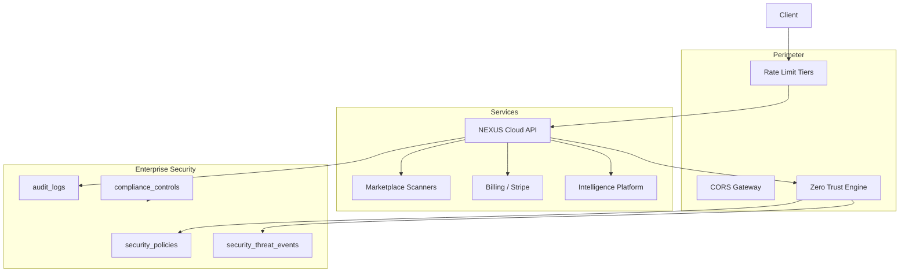
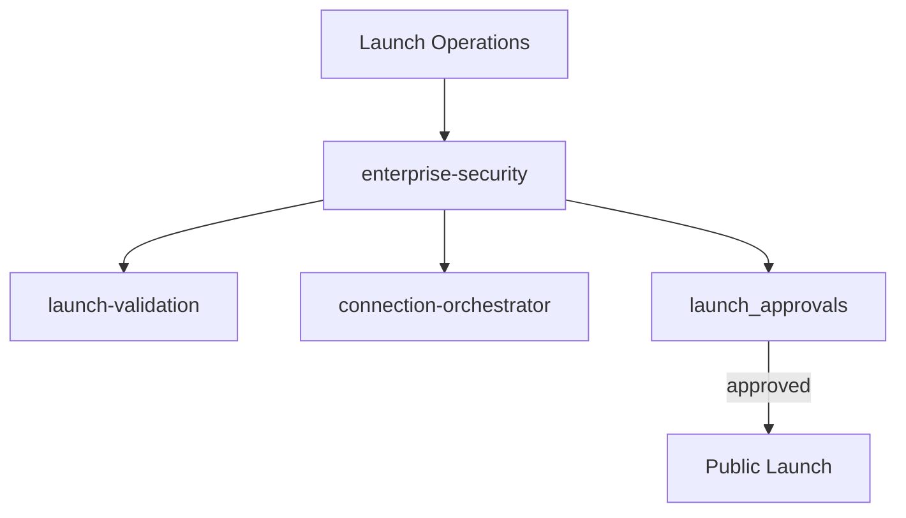

# EPIC 33 — Enterprise Security + Public Launch STOP Report

## Quality Gate

| Check | Status |
|-------|--------|
| Zero Trust implemented | ✓ Policy engine + MFA compliance |
| Marketplace secured | ✓ Signatures, scans, secure download verify |
| Billing secured | ✓ PCI-aligned + live checklist |
| AI secured | ✓ Inference logging + security checklist |
| Cloud secured | ✓ Secrets, rate limits, audit, non-root container |
| Platform monitoring operational | ✓ Enterprise ops + threat events |
| Incident response operational | ✓ Ops + public status bridge |
| Production deployment verified | ✓ Deployment center + readiness dashboard |
| Launch approved | ✓ Approval workflow with score gates |
| Build | ✓ `tsc --noEmit` |
| TypeScript | ✓ |
| Documentation | ✓ ADR-125 through ADR-128 |

Note: User-requested ADR numbers 121–124 used by EPIC 32. EPIC 33 uses **125–128**.

## Folder Tree

```
nexus-cloud/
├── packages/enterprise-security/     # NEW
│   └── src/
│       ├── index.ts
│       ├── securityPlatform.ts
│       └── launchOps.ts
├── packages/database/
│   ├── migrations/0021_enterprise_security_launch.sql
│   └── src/schema/security.ts
├── apps/api/src/routes/enterprise-security.ts
nexus-studio/src/command-center/panels/
├── SecurityCenterPanel.tsx
├── SocDashboardPanel.tsx
├── CompliancePanel.tsx
├── ThreatMonitorPanel.tsx
├── DeploymentCenterPanel.tsx
├── LaunchOperationsPanel.tsx
├── IncidentCenterPanel.tsx
└── StatusCenterPanel.tsx
nexus-website/docs/adr/ADR-125..128
```

## Security Architecture



## Deployment Architecture

```mermaid
flowchart LR
  DC[Deployment Center]
  DEP[@nexus-cloud/deployment]
  REL[deploy_releases]
  SNAP[deploy_db_snapshots]
  DR[deploy_dr_plans]

  DC --> DEP --> REL
  DEP --> SNAP
  DEP --> DR
```

## Launch Architecture



## Incident Response

1. **Detection**: Enterprise ops alerts → `ops_incidents`
2. **Security**: Threat events → `security_threat_events` → SOC dashboard
3. **Publication**: `POST /v1/launch-ops/incidents/bridge/:opsIncidentId` → public status page
4. **Resolution**: Resolve ops incident + public incident via Launch Ops API

## Compliance

| Framework | Controls | Status |
|-----------|----------|--------|
| SOC 2 | CC6.1, CC7.2, CC8.1 | Implemented |
| PCI | 3.4, 10.1 | Implemented |
| GDPR | Art17, Art32 | Mixed |
| CCPA | 1798.100, 1798.105 | Mixed |

## Files Created

- `@nexus-cloud/enterprise-security` (3 source files)
- Migration `0021`, schema `security.ts`
- API routes `enterprise-security.ts`
- 8 Command Center panels
- ADR-125 through ADR-128

## Files Modified

- `apps/api/src/app.ts`, `context.ts`, `routes/index.ts`, `package.json`
- `packages/database/src/schema/index.ts`
- `nexus-studio/CommandCenterPanel.tsx`

## Future Work

- Per-org rate limit middleware enforcement
- Supabase MFA enforcement hook
- CI npm audit + container scan gates
- Playwright E2E in launch validation
- Automated ops → status page sync
- SOC 2 external audit evidence export
- ROS/OTA/Digital Twin dedicated security policies

**STOP.**
